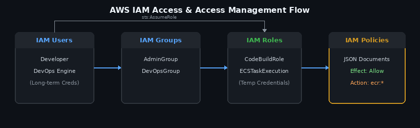

# 🏰 AWS IAM — The Castle Security System

> *"Who gets in, who doesn't, and what they can touch once they're inside."*

Think of your AWS account as a **castle** full of valuable rooms (S3 buckets, EC2 servers, databases...).
**IAM (Identity and Access Management)** is the security system deciding who holds a key, who's on the guest list, and what each visitor is allowed to open once inside.

Without IAM, it's like leaving the front gate open with a sign that says *"treasure room, no lock."* 😬

---

## 🔑 What IAM Actually Does

IAM is the AWS service that controls **authentication** (who are you?) and **authorization** (what are you allowed to do?).

It works through four main building blocks — let's meet the cast.

---

## 👤 Users — The Residents

**IAM Users** are individual identities — a real person or an application that needs long-term access.

- Unique name + credentials (password or access keys)
- Access lasts until someone manually removes it
- Analogy: **a resident with their own house key** — permanent, personal, theirs alone

```
🧑 Sarah → has her own login → walks into the castle whenever she wants
```

---

## 👥 Groups — The Guilds

**IAM Groups** bundle users who share the same job.

- Instead of handing out permissions one by one, you equip an entire guild at once
- Add or remove members freely — the guild's rules stay the same
- Analogy: **the Blacksmiths' Guild** — every blacksmith automatically gets access to the forge, no individual negotiation needed

```
👥 "Developers" guild → access to EC2 & S3 → add/remove members anytime
```

---

## 🎭 Roles — The Disguises

**IAM Roles** grant *temporary* access — no permanent identity attached.

- No fixed password or long-term keys
- Credentials are **borrowed**, and they expire automatically
- Analogy: **a hotel keycard** — works while you're a guest, deactivates the moment you check out

```
🖥️ EC2 server → puts on a "Role" → reads from S3 for a few hours → access expires
```

This is why roles are the **safe default** for apps and services — no hardcoded secrets sitting around waiting to be stolen.

---

## 📜 Policies — The Rulebook

**IAM Policies** are JSON documents that spell out exactly what's allowed or denied.

```json
{
  "Version": "2012-10-17",
  "Statement": [
    {
      "Effect": "Allow",
      "Action": "s3:GetObject",
      "Resource": "arn:aws:s3:::treasure-room/*"
    }
  ]
}
```

- Attached to Users, Groups, or Roles
- Comes in two flavors: **AWS Managed** (pre-written by Amazon) or **Customer Managed** (written by you)
- Golden rule: **an explicit Deny always beats an Allow** — no exceptions

---
## AWS IAM Architecture

## 🛡️ The Guiding Principle: Least Privilege

Give every identity **only what it needs** — nothing more.

- A guard watching the front gate doesn't need keys to the treasury
- An intern uploading files doesn't need permission to delete the whole database

Less access = smaller blast radius if something goes wrong.

---

## 🧭 Bonus Defenses

| Feature | What it does |
|---|---|
| **MFA** (Multi-Factor Authentication) | A second lock on the door — password *and* a code from your phone |
| **Audit Trail (CloudTrail)** | The castle's logbook — records who entered, when, and what they touched |

---

## 🗝️ TL;DR

| Concept | Real-world analogy |
|---|---|
| User | Resident with a personal house key |
| Group | Guild sharing the same access |
| Role | Hotel keycard — temporary, expires |
| Policy | The rulebook stating what's allowed |
| Least Privilege | Only give out the keys that are actually needed |

**IAM is the difference between a castle that's actually secure and one that just *looks* secure from the outside.**

---

*📚 Notes from my AWS learning journey — feel free to fork, comment, or suggest edits!*
